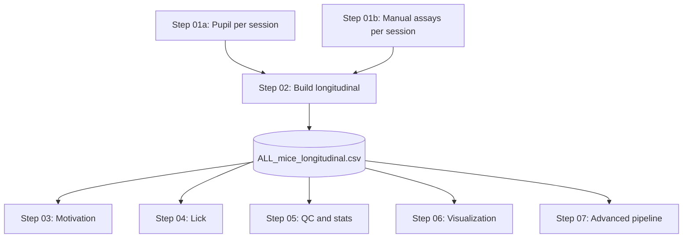

# Pipeline: Run order and roadmap

**Run order:** Do all **per-session** work (Step 01a + 01b), then **Step 02** (build longitudinal). Then run **downstream** steps 03–07 in any order.

---

## Flow

| Step | Description |
|------|-------------|
| 01a | Pupil tracking + alignment (per session/video) |
| 01b | Manual scoring: TST, HOT, Straub, etc. (per session); results feed into Step 02 |
| 02 | Build one folder: `longitudinal_outputs/run_###/`, **ALL_mice_longitudinal.csv** (all mice × all days) |
| 03 | Motivation (PR) — downstream |
| 04 | Lick pipeline — downstream |
| 05 | QC, longitudinal stats/plots — downstream |
| 06 | Dashboards, rasters, event-locked pupil — downstream |
| 07 | Advanced: EFA, modules 5–12, Straub, addiction score, predictive — downstream |

---

## Dependencies

- **01a, 01b:** Per-session; set paths in each script. Do for all sessions before Step 02.
- **02:** Set `BASE` in `step02_build_longitudinal/Longitudinal_final_trialrequire_HOTTST_passive_final_handle_nomatchingstrabu.m`.
- **03–07:** Use the **latest** `run_*` under `longitudinal_outputs` (script logic or path at top).

---

## Advanced pipeline (Step 07): plan → MATLAB

| Plan / Module | MATLAB implementation |
|---------------|------------------------|
| Module 5 (Feature QC) | `analyze_modules_5_to_11` |
| Module 6 (GLMM/LME) | `analyze_modules_5_to_11` |
| Module 7 (PCA, clustering, EFA) | `analyze_modules_5_to_11` |
| Module 8 (Event-locked) | `analyze_modules_5_to_11` |
| Module 9 (Cumulative fit) | `analyze_modules_5_to_11` |
| Module 10 (Cross-modal) | `analyze_modules_5_to_11` |
| Module 11 (RL model) | `analyze_modules_5_to_11` |
| Module 12 (Predictive) | `analyze_modules_5_to_11` / `analyze_modules_5_to_12` |
| Straub tail | `compute_straub_tail_only_v1` |
| Dashboard / preprocessing | `analyze_passive_active_dashboard_dec2` |
| Addiction score / EFA | `analyze_addiction_score_efa_*.m` |
| Longitudinal QC | `make_longitudinal_QC_and_requested_analyses_NEWCOHORT_20260203_cursor.m` |
| Rasters | `plotLickAndBoutRasters_SelectedDays.m` |

Add these scripts to **step07_advanced/** as they are implemented. Complementary EFA/decoder/cross-generalization exist in the Python repo.
