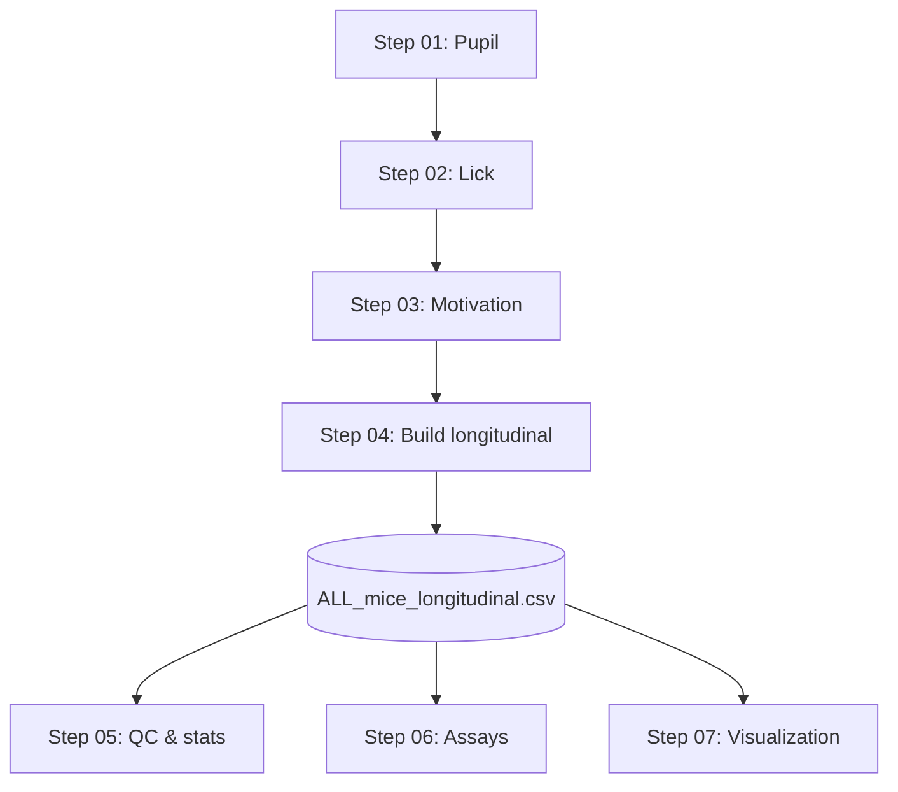

# Pipeline: Run order and roadmap

Run order: **Step 01 → 02 → 03 → 04 → 05 → 06 → 07.**

After **Step 01, 02, 03** you run **Step 04** to build **longitudinal_outputs** and the master CSV. Steps 05–07 then use that CSV.

---

## Flow

| Step | Output |
|------|--------|
| 01 | Pupil CSVs, aligned to Saleae |
| 02 | Lick analyses, per_session_features (if applicable) |
| 03 | Trial/session motivation tables and plots |
| 04 | `longitudinal_outputs/run_###/ALL_mice_longitudinal.csv` |
| 05 | `run_###/figs/`, QC_AND_REQUESTED_ANALYSES_* |
| 06 | Assay summaries; manual scoring |
| 07 | Dashboards, rasters, event-locked pupil, arranged figures |

---

## Dependencies

- **01–03:** Use your raw/per-session data paths (set in each script).
- **04:** Set `BASE` in `step04_build_longitudinal/Longitudinal_final_trialrequire_HOTTST_passive_final_handle_nomatchingstrabu.m`.
- **05–07:** Use the **latest** `run_*` under `longitudinal_outputs` (script logic or path set at top).

---

## Roadmap mapping (modules → steps)

| Roadmap module | MATLAB step |
|----------------|-------------|
| Pupil, alignment, session-level features | 01, 04 |
| Lick, microstructure, rhythm, PCA/clustering | 02 |
| Motivation (PR), LME/GLMM-style analyses | 03, 05 |
| QC, longitudinal plots/stats | 05 |
| Assays (TI, TST, HP, Straub) | 06 |
| Event-locked, dashboards, visualization | 07 |

Decoder / EFA / cross-generalization are in a separate (e.g. Python) repo, not this one.
