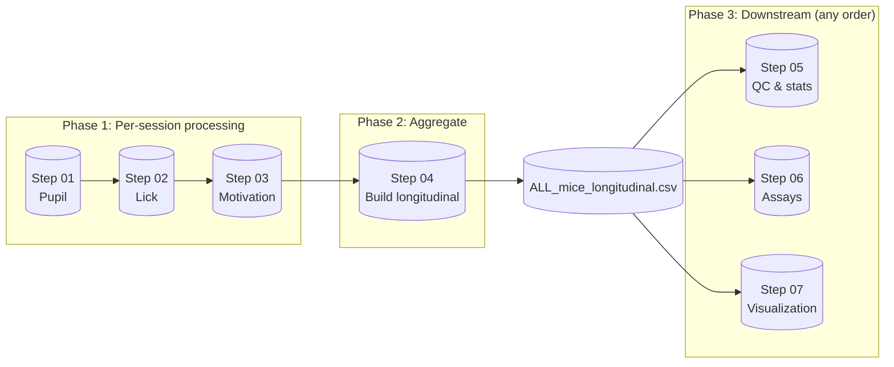

# Morphine PR Behavioral Pipeline (MATLAB)

MATLAB pipeline for the morphine progressive-ratio (PR) self-administration experiment. This repo is a **standalone** analysis repository (separate from autoresearch). Run **Step 01 → Step 02 → Step 03** first; after that, **Step 04** builds `longitudinal_outputs` and the master CSV. Then run Steps 05–07 for QC, assays, and visualization.

---

## Pipeline schematic



**Run order:** 01 → 02 → 03 → 04 (creates `longitudinal_outputs`). Then 05, 06, 07 use the latest `run_*/ALL_mice_longitudinal.csv`.

---

## Repository layout

```
opioidaddiction-matlab/
├── README.md                 ← you are here
├── PIPELINE.md               ← run order and roadmap mapping
├── .gitignore
│
├── step01_pupil/             ← run first: pupil tracking + alignment
├── step02_lick/              ← then: lick mega-pipeline + patterns
├── step03_motivation/         ← then: motivation (PR) analysis
├── step04_build_longitudinal/← then: build longitudinal_outputs + ALL_mice_longitudinal.csv
├── step05_qc_and_longitudinal/
├── step06_assays/
└── step07_visualization/
```

Each step folder contains its `.m` scripts and a **README.md** describing what to run.

---

## Run order (Step 01 → end)

| Step | Folder | What it does |
|------|--------|----------------|
| **01** | [step01_pupil](step01_pupil/) | Pupil tracking (U-Net training + inference) and alignment to Saleae digital TTLs. Run per session/video. |
| **02** | [step02_lick](step02_lick/) | Lick mega-pipeline; optional PCA/k-means on session-level lick features. |
| **03** | [step03_motivation](step03_motivation/) | Motivation (PR) trial/session tables and plots. |
| **04** | [step04_build_longitudinal](step04_build_longitudinal/) | **Build** `longitudinal_outputs/run_###/` and **ALL_mice_longitudinal.csv** from raw session data (JSONL, Saleae, combined_pupil_digital). Run after 01–03. |
| **05** | [step05_qc_and_longitudinal](step05_qc_and_longitudinal/) | QC, requested analyses, longitudinal plots and stats (uses latest `run_*/ALL_mice_longitudinal.csv`). |
| **06** | [step06_assays](step06_assays/) | TST, HOT, Straub tail summaries; manual scoring helpers. |
| **07** | [step07_visualization](step07_visualization/) | Passive/active dashboards, PR+pupil rasters, event-locked pupil, arranged figures. |

**Summary:** Run **01 → 02 → 03** (pupil, lick, motivation). Then run **04** to create `longitudinal_outputs`. After that, run **05, 06, 07** in any order (they read the latest `run_*/ALL_mice_longitudinal.csv`).

---

## Requirements

- **MATLAB** (Deep Learning Toolbox for U-Net in Step 01 if you use the pupil U-Net).
- **Data:** Per-session inputs for 01–03 (video, pupil, Saleae, JSONL, etc.); for Step 04 set **`BASE`** in the longitudinal script to your raw data root (e.g. `K:\addiction_concate_Dec_2025`). Step 04 expects a layout like `BASE\day1..dayN\<cage>\<mouse>\concat_out_*\` with `combined_pupil_digital.csv`/`.xlsx` and `*.jsonl`.

---

## Quick start

1. **Step 01 (pupil)** — Open `step01_pupil/`, set paths in the scripts (e.g. `step1_2dec29_nove222222222.m`, `step3_dec291123342.m`, `alignment_pupil_salae_aug20.m`), run per session.
2. **Step 02 (lick)** — Run `run_lick_mega_pipeline` or `run_lick_mega_pipeline_new` from `step02_lick/`; optionally `analyze_lick_patterns_MASTER`.
3. **Step 03 (motivation)** — Run `run_motivation_analysis` or `run_motivation_analysis_new` from `step03_motivation/`.
4. **Step 04 (longitudinal)** — Open `step04_build_longitudinal/Longitudinal_final_trialrequire_HOTTST_passive_final_handle_nomatchingstrabu.m`, set **`BASE`**, run. This creates `BASE\longitudinal_outputs\run_###\ALL_mice_longitudinal.csv`.
5. **Steps 05–07** — Run scripts from each folder as needed; they use the latest `run_*` output. See each step’s README for script names and variants.

---

## Outputs

- **Step 04:** `BASE\longitudinal_outputs\run_###\` (e.g. `ALL_mice_longitudinal.csv`, `features_day_level.csv`).
- **Steps 05–07:** Figures and tables mostly under `run_###\figs\` and `run_###\QC_AND_REQUESTED_ANALYSES_*\`.

---

## License

See [LICENSE](LICENSE) if present.
