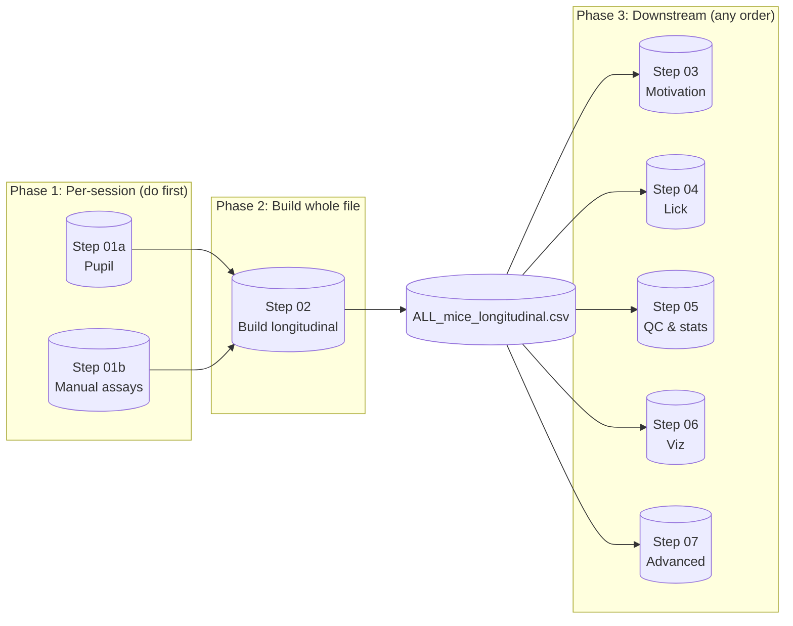

# Morphine PR Behavioral Pipeline (MATLAB)

MATLAB pipeline for the morphine progressive-ratio (PR) self-administration experiment. **First** do all per-session work (pupil + manual assays). **Then** build one longitudinal folder (all mice × all days). **After that**, run downstream analyses: motivation, licking, reward, pupil, delta, statistics, plots, pharmacology, and the advanced pipeline (EFA, modules 5–12).

---

## Pipeline schematic



**Run order:** Do **Step 01a (pupil)** and **Step 01b (manual assays)** for every session. Then run **Step 02** to create **longitudinal_outputs** (one folder, all mice × all days). Then run **Steps 03–07** (downstream) in any order; they all use the latest `run_*/ALL_mice_longitudinal.csv`.

---

## Repository layout

```
opioidaddiction-matlab/
├── README.md
├── PIPELINE.md
├── .gitignore
│
├── step01_pupil/           ← Per-session: pupil tracking + alignment
├── step01_manual_assays/   ← Per-session: manual scoring (TST, HOT, Straub, etc.)
├── step02_build_longitudinal/  ← Build one folder: all mice × all days
├── step03_motivation/      ← Downstream: motivation (PR)
├── step04_lick/            ← Downstream: lick pipeline
├── step05_qc_and_longitudinal/  ← Downstream: QC, stats, plots
├── step06_visualization/   ← Downstream: dashboards, rasters, event-locked
└── step07_advanced/        ← Downstream: EFA, modules 5–12, Straub, addiction score, etc.
```

Each step folder has a **README.md** and its `.m` scripts.

---

## Run order (Step 01 → end)

| Step | Folder | What it does |
|------|--------|----------------|
| **01a** | [step01_pupil](step01_pupil/) | Per-session: pupil tracking (U-Net + alignment to Saleae). Run for every session/video. |
| **01b** | [step01_manual_assays](step01_manual_assays/) | Per-session: manual scoring for TST, HOT, Straub tail, etc. Results go into Step 02. |
| **02** | [step02_build_longitudinal](step02_build_longitudinal/) | **Build** one folder: `longitudinal_outputs/run_###/` and **ALL_mice_longitudinal.csv** (all mice × all days). Run after all 01a/01b. |
| **03** | [step03_motivation](step03_motivation/) | Downstream: motivation (PR) trial/session tables and plots. |
| **04** | [step04_lick](step04_lick/) | Downstream: lick mega-pipeline, PCA/k-means on lick features. |
| **05** | [step05_qc_and_longitudinal](step05_qc_and_longitudinal/) | Downstream: QC, longitudinal stats and plots. |
| **06** | [step06_visualization](step06_visualization/) | Downstream: passive/active dashboards, PR+pupil rasters, event-locked pupil. |
| **07** | [step07_advanced](step07_advanced/) | Downstream: EFA, modules 5–12 (QC, GLMM, PCA/EFA, event-locked, predictive), Straub, addiction score, rasters. |

---

## Advanced pipeline (Step 07): plan → MATLAB

| Plan / Module | MATLAB implementation |
|---------------|------------------------|
| Module 5 (Feature QC) | `analyze_modules_5_to_11` |
| Module 6 (GLMM/LME) | `analyze_modules_5_to_11` |
| Module 7 (PCA, clustering, EFA) | `analyze_modules_5_to_11` |
| Module 8 (Event-locked) | `analyze_modules_5_to_11` |
| Module 9 (Cumulative fit) | `analyze_modules_5_to_11` |
| Module 10 (Cross-modal) | `analyze_modules_5_to_11` |
| Module 11 (RL model) | `analyze_modules_5_to_11` |
| Module 12 (Predictive) | `analyze_modules_5_to_11` / `analyze_modules_5_to_12` |
| Straub tail | `compute_straub_tail_only_v1` |
| Dashboard / preprocessing | `analyze_passive_active_dashboard_dec2` |
| Addiction score / EFA | `analyze_addiction_score_efa_*.m` |
| Longitudinal QC | `make_longitudinal_QC_and_requested_analyses_NEWCOHORT_20260203_cursor.m` |
| Rasters | `plotLickAndBoutRasters_SelectedDays.m` |

Add the corresponding `.m` files to **step07_advanced/** as they are implemented. EFA/decoder/cross-generalization are also implemented in the Python repo (e.g. autoresearch-behavior).

---

## Requirements

- **MATLAB** (Deep Learning Toolbox for U-Net in Step 01a if used).
- **Data:** Per-session inputs for 01a/01b; for Step 02 set **`BASE`** in the longitudinal script (e.g. `K:\addiction_concate_Dec_2025`). Step 02 expects `BASE\day1..dayN\<cage>\<mouse>\concat_out_*\` with `combined_pupil_digital.csv`/`.xlsx` and `*.jsonl`.

---

## Quick start

1. **Step 01a (pupil)** — Run pupil scripts in `step01_pupil/` for every session; set paths at top of each script.
2. **Step 01b (manual assays)** — Run manual scoring (TST, HOT, Straub) in `step01_manual_assays/`; set folder paths as needed.
3. **Step 02 (longitudinal)** — Open `step02_build_longitudinal/Longitudinal_final_trialrequire_HOTTST_passive_final_handle_nomatchingstrabu.m`, set **`BASE`**, run. Creates `BASE\longitudinal_outputs\run_###\ALL_mice_longitudinal.csv`.
4. **Steps 03–07** — Run from each folder as needed; all use the latest `run_*` output. See each step’s README for script names.

---

## Outputs

- **Step 02:** `BASE\longitudinal_outputs\run_###\` (e.g. `ALL_mice_longitudinal.csv`, `features_day_level.csv`).
- **Steps 03–07:** Figures and tables under `run_###\figs\`, `run_###\QC_AND_REQUESTED_ANALYSES_*\`, etc.

---

## Publish to GitHub

1. Create a new repository on GitHub (e.g. `opioidaddiction-matlab`) — do **not** add a README or .gitignore.
2. In this folder:
   ```bash
   cd path/to/opioidaddiction-matlab
   git remote add origin https://github.com/YOUR_USERNAME/opioidaddiction-matlab.git
   git branch -M main
   git push -u origin main
   ```
   Use a [Personal Access Token](https://github.com/settings/tokens) as password if prompted.

---

## License

See [LICENSE](LICENSE) if present.
