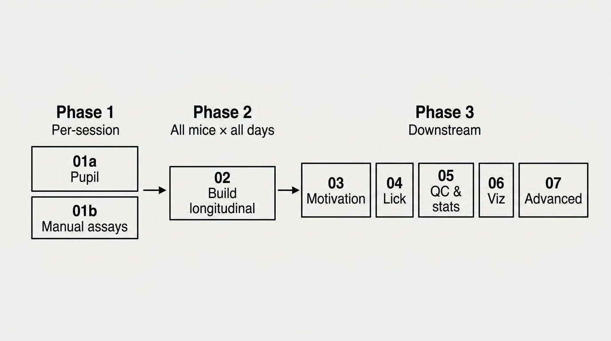
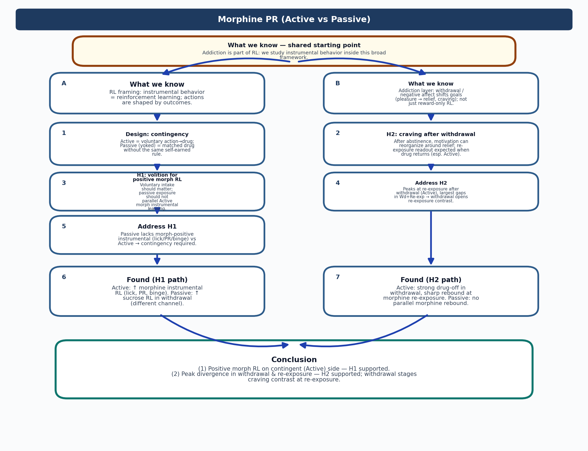
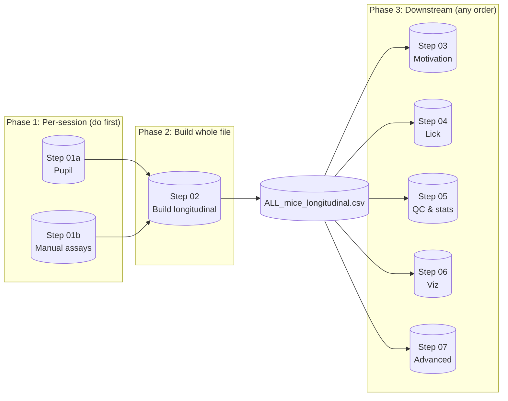

# Morphine PR Behavioral Pipeline (MATLAB)

MATLAB pipeline for the **morphine progressive-ratio (PR)** self-administration experiment: from per-session pupil and assay data to one longitudinal table (all mice × all days), then to motivation, licking, QC, visualization, and advanced analyses (EFA, Straub, addiction score).

**New here?** Three phases: (1) Run per-session steps 01a and 01b for every session. (2) Run step 02 once to build the longitudinal CSV. (3) Run steps 03–07 in any order. In each step folder, pick **one** script per purpose (see the "run one of" table in each README).

---

## Pipeline at a glance



| Phase | Steps | What you do |
|-------|--------|-------------|
| **1. Per-session** | 01a Pupil, 01b Manual assays | Run for **every** session/video (pupil tracking + alignment; manual scoring for TST, HOT, Straub). |
| **2. Build whole file** | 02 Build longitudinal | Run **once** after all sessions: creates one folder with **ALL_mice_longitudinal.csv** (all mice × all days). |
| **3. Downstream** | 03–07 | Run **in any order**; each step reads the latest longitudinal CSV. Pick **one script per purpose** (see each step’s README). |

**Run order:** Phase 1 (all sessions) → Phase 2 (once) → Phase 3 (any order).

---

## Addiction vs reinforcement learning (logic)

Concept figure for the morphine PR framing: one shared starting point, two branches (instrumental RL vs addiction-layer hypotheses), then conclusion. Labels and step markers (A, B, 1–7) are drawn **inside** the rounded boxes.



PDF: [addiction_rl_logic_flowchart.pdf](addiction_rl_logic_flowchart.pdf)

---

## Pipeline schematic (Mermaid)



---

## Repository layout

```
opioidaddiction-matlab/
├── README.md
├── PIPELINE.md
├── .gitignore
│
├── step01_pupil/           ← Per-session: pupil tracking + alignment
├── step01_manual_assays/   ← Per-session: manual scoring (TST, HOT, Straub, etc.)
├── step02_build_longitudinal/  ← Build one folder: all mice × all days
├── step03_motivation/      ← Downstream: motivation (PR)
├── step04_lick/            ← Downstream: lick pipeline
├── step05_qc_and_longitudinal/  ← Downstream: QC, stats, plots
├── step06_visualization/   ← Downstream: dashboards, rasters, event-locked
└── step07_advanced/        ← Downstream: EFA, modules 5–12, Straub, addiction score, etc.
```

Each step folder has a **README.md** and its `.m` scripts.

---

## Run order (Step 01 → end)

| Step | Folder | What it does |
|------|--------|----------------|
| **01a** | [step01_pupil](step01_pupil/) | Per-session: pupil tracking (U-Net + alignment to Saleae). Run for every session/video. |
| **01b** | [step01_manual_assays](step01_manual_assays/) | Per-session: manual scoring for TST, HOT, Straub tail, etc. Results go into Step 02. |
| **02** | [step02_build_longitudinal](step02_build_longitudinal/) | **Build** one folder: `longitudinal_outputs/run_###/` and **ALL_mice_longitudinal.csv** (all mice × all days). Run after all 01a/01b. |
| **03** | [step03_motivation](step03_motivation/) | Downstream: motivation (PR) trial/session tables and plots. |
| **04** | [step04_lick](step04_lick/) | Downstream: lick mega-pipeline, PCA/k-means on lick features. |
| **05** | [step05_qc_and_longitudinal](step05_qc_and_longitudinal/) | Downstream: QC, longitudinal stats and plots. |
| **06** | [step06_visualization](step06_visualization/) | Downstream: passive/active dashboards, PR+pupil rasters, event-locked pupil. |
| **07** | [step07_advanced](step07_advanced/) | Downstream: EFA, modules 5–12 (QC, GLMM, PCA/EFA, event-locked, predictive), Straub, addiction score, rasters. |

---

## Advanced pipeline (Step 07)

Many scripts in **step07_advanced/** are variants (A, A′, A″); **run one per purpose.** See [step07_advanced/README.md](step07_advanced/README.md) for the "run one of" table. Summary:

| Purpose | Run **one of** (in step07_advanced/) |
|---------|--------------------------------------|
| Modules 5–12 (QC, GLMM, PCA/EFA, event-locked, predictive) | `analyze_modules_5_to_11.m`, `analyze_modules_5_to_11_new.m`, or `analyze_advanced_pipeline.m` |
| Straub tail | `compute_straub_tail_only_v1.m`, `compute_straub_nonmoving_only_v1.m` |
| Dashboard | `analyze_passive_active_dashboard_dec2.m`, `analyze_passive_active_dashboard_dec.m` |
| Addiction score / EFA | `analyze_addiction_score_efa_dec4.m` (or dec3, dec2, both, mousefit) |
| Longitudinal QC | `make_longitudinal_QC_and_requested_analyses_NEWCOHORT_20260203_cursor.m` (or other QC variants there) |

EFA/decoder/cross-generalization also in the Python repo (e.g. autoresearch-behavior).

---

## Requirements

- **MATLAB** (Deep Learning Toolbox for U-Net in Step 01a if used).
- **Data:** Per-session inputs for 01a/01b; for Step 02 set **`BASE`** in the longitudinal script (e.g. `K:\addiction_concate_Dec_2025`). Step 02 expects `BASE\day1..dayN\<cage>\<mouse>\concat_out_*\` with `combined_pupil_digital.csv`/`.xlsx` and `*.jsonl`.

---

## Quick start

1. **Step 01a (pupil)** — Run pupil scripts in `step01_pupil/` for every session; set paths at top of each script.
2. **Step 01b (manual assays)** — Run manual scoring (TST, HOT, Straub) in `step01_manual_assays/`; set folder paths as needed.
3. **Step 02 (longitudinal)** — Open `step02_build_longitudinal/Longitudinal_final_trialrequire_HOTTST_passive_final_handle_nomatchingstrabu.m`, set **`BASE`**, run. Creates `BASE\longitudinal_outputs\run_###\ALL_mice_longitudinal.csv`.
4. **Steps 03–07** — Run **one script per purpose** from each folder (each step’s README has a “run one of” table). All use the latest `run_*` output.

---

## Outputs

- **Step 02:** `BASE\longitudinal_outputs\run_###\` (e.g. `ALL_mice_longitudinal.csv`, `features_day_level.csv`).
- **Steps 03–07:** Figures and tables under `run_###\figs\`, `run_###\QC_AND_REQUESTED_ANALYSES_*\`, etc.

---

## Publish to GitHub

1. Create a new repository on GitHub (e.g. `opioidaddiction-matlab`) — do **not** add a README or .gitignore.
2. In this folder:
   ```bash
   cd path/to/opioidaddiction-matlab
   git remote add origin https://github.com/YOUR_USERNAME/opioidaddiction-matlab.git
   git branch -M main
   git push -u origin main
   ```
   Use a [Personal Access Token](https://github.com/settings/tokens) as password if prompted.

---

## License

See [LICENSE](LICENSE) if present.
